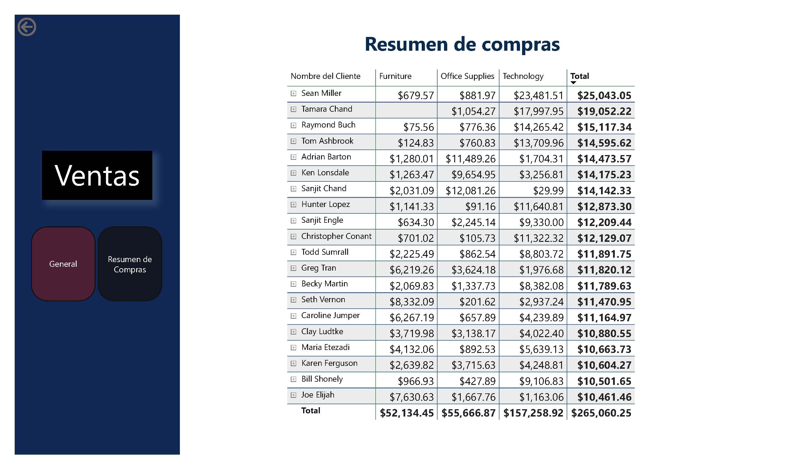

# Diplomado_Analitica_Ciencia_Datos-Power-BI

## Contexto
Un dashboard en Power BI debe ser mucho más que una simple herramienta de visualización; debe ser una experiencia transformadora para los clientes. La verdadera esencia de un dashboard radica en su capacidad para convertir datos complejos en información accesible y útil, facilitando una toma de decisiones informada y estratégica.

## Objetivo
Desarrollar un dashboard de ventas en Power BI Desktop utilizando el archivo de datos "Sample - Superstore - Orders Only.csv". Este dashboard deberá integrar y visualizar la información de ventas de manera clara y efectiva, proporcionando insights clave sobre el rendimiento de las ventas y facilitando la toma de decisiones basada en datos.

## Resultados
En el dashboard se han incluido, en forma de resumen, tres tarjetas que permiten visualizar el monto total de ventas, el monto total de ingresos y la cantidad de transacciones. Además, se han incorporado cuatro segmentadores que facilitan un análisis ágil por ubicación geográfica y por mes-año, herramientas esenciales para una inteligencia temporal efectiva.

Estos segmentadores filtran la información presentada en cuatro gráficos: dos gráficos de áreas, que resumen la cantidad de ventas a lo largo de los meses y años; un gráfico de mapa, que utiliza círculos para identificar las localidades con mayores ventas; y un gráfico de barras apiladas, que muestra el top 5 de los productos más vendidos.

Asimismo, se ha añadido una hoja de Detalles de Clientes, la cual proporciona información sobre los clientes que han adquirido alguno de los productos más vendidos, a través de la funcionalidad de "ToolTip".

Finalmente, se dispone de otra hoja que ofrece información detallada sobre los clientes, clasificada según el monto total de sus compras.

## Resultado

